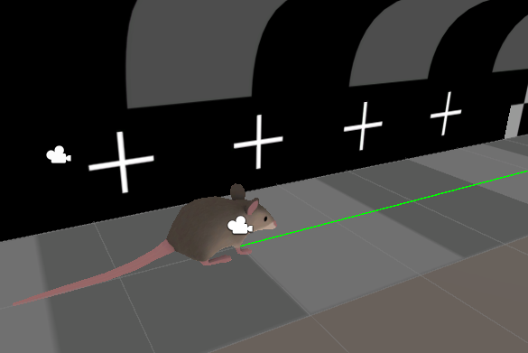
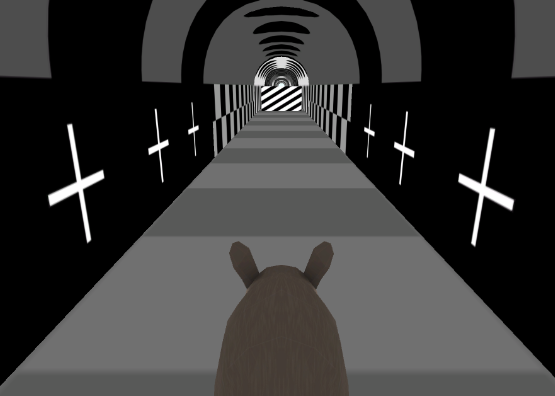
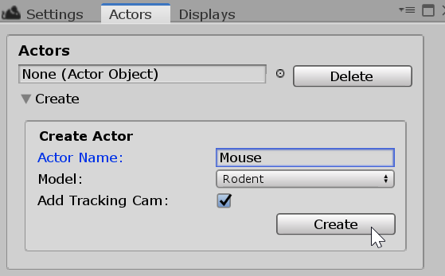
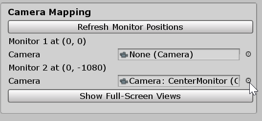
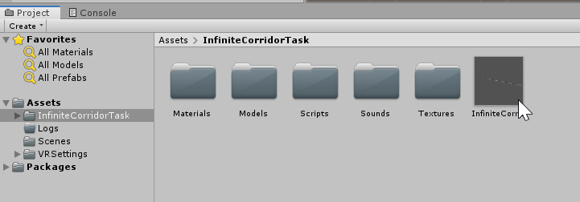
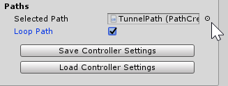
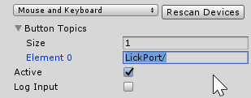

# Gimbl
A modular and flexible software package for performing VR animal experiments in Unity.

## Features

* __Modular:__ Each Gimbl project consists of Actors, Controllers, Displays, and Task logic that operate independently and can be expanded or adjusted individually.
* __Flexible:__ All device or intersoftware communication occurs through a [MQTT Broker](https://www.hivemq.com/mqtt-essentials/) which follows a simple subscribe/publish scheme. As a result, Gimbl is completely hardware independent and tasks can be easily tested and shared between systems.
* __Expandable:__ Gimbl is build on top of the powerfull Unity Game engine meaning advanced 3d audio and graphic capabilities are available straight out of the box. Unity has an excellent active user community and many easy-to-follow tutorials are available online.

## Install Instructions
### Requirements
* Right now, this package is Windows only(!) Although Linux/Mac support could be added at a later time.
* Device and external software communication occurs over the MQTT protocol and Gimbl expects access to a MQTT Broker (local or on the network). We have tested the software with the Eclipse Mosquitto broker which can be downloaded [here](https://mosquitto.org/).

Please check out the [Wiki](https://github.com/winnubstj/Gimbl/wiki) for more detailed info.

## Quick Start.
This guide takes you through all the basic steps of setting up a VR task for the first time. We will then import a simple infinite corridor task where the animal has to report a fixed location on a 1d track. It will also explain how to simulate a input from a external sensor.

 

### Import Gimbl into Unity
* Create new unity project (make sure to delete any camera in the scene).
* Go to Window->Package manager.
* Press the little plus sign at the bottom of the new window and select 'Add package from disk...'
* Select the 'package.json' file in the 'Gimbl-Package' folder.
* All menus and controls should now be available under Window->Gimbl
### Setting up the Actor
Actors represent the animal within the VR environment. They can have a linked Controller (that control movement) and Display object.
* __Creating an Actor:__ First, go to 'Actors' and click the dropdown 'Create' menu. Select 'Rodent' as a model (this is purely aesthetical) and enter a name.

	
* __Creating a Display:__ Go to 'Displays' -> 'Create' and select the 'MyMonitorSetup' model and give it a name. This model represent a simple three monitor setup (left,center, and right). See below to create a custom display model to fit your specific physical setup. Once you created the object you can go to the 'Camera Mapping' section and link your monitors to the  appropriate created camera views by clicking on the circled dot icon next to the monitor name. In the image below I have set my second monitor to the center monitor view. Click 'Show Full-Screen Views' to show the camera views.

	
* __Creating a Controller:__ For this example we are going to simulate a linear treadmill that controls the movement of the actor through the VR environment (See the wiki on how to use MQTT to interface your device with a Gimbl controller). Under the Actors window go to the 'Controllers' section and select the 'Create' dropdown menu. Set the type to be 'Simulated Linear Treadmill' and give it a name.
* __Linking everything together:__ We now have to link the Controller and Display objects to the Actor. In the Actors menu click on the circled dot next to 'Controller' and select your controller from the list. Do the same for the 'Display' section. Both the text "Controller" and "Display" should show up as green now.
### Setting up the task
* __Import the task assets:__ On the main menu bar go to 'Assets' -> 'Import Package' -> 'Custom Package' and browse to 'examples/tasks/InfiniteCorridorTask.unitypackage'. A window will popup asking you what you want to import, since we want to import everything just click 'Import'. 
* __Placing the corridor:__ You should now see a new folder in your project view ('Assets/InfiniteCorridorTask'). In it you will see a Unity [prefab](https://docs.unity3d.com/Manual/Prefabs.html) object called InfiniteCorridor. Drag and drop this file onto the [Hierarchy window](https://docs.unity3d.com/Manual/Hierarchy.html). You should now see the corridor.

	

* __Setting the path:__ The infinite corridor works by looping the Actor along a fixed path. You have to link the controller to follow this path. In the Gimbl Actors window select the'Controller' -> 'Edit' dropdown menu. There you can see a section 'Paths'. Set the selected path to 'TunnelPath' and check the 'Loop Path' box. This tells the controller to start back at the beginning once its reached the end of the path, thus creating an infinite corridor effect.

	

### Try out the task!
* __Start the task:__ Press the play button on the center top of the unity window to start the task. You can control the 'Mouse' with the 'w' and 's' keys. 
* __Change the task parameters:__ You can change the task parameters by clicking on the 'InfiniteCorridorTask' object in the hierarchy window (settings will show up in the [Inspector window](https://docs.unity3d.com/Manual/UsingTheInspector.html) on the right). For instance, you can turn off the visible marker that shows the reward location. 
* __Simulating a sensor device input:__ The other task parameter 'Must Lick' signals that the animal has to actively report the reward location by touching the lickport in order to get a reward. Since all device interactions happen through the MQTT broker we can easily simulate such a response. In the controller window select 'Button Topics' and set size to '1'. In the new line 'Element0' type 'LickPort/' (must be precise spelling). Thats it! Now when you restart the task you can simulate a lick reponse by clicking the left mouse button.

	

## Licensing
Distributed under the Janelia Open Source License (https://www.janelia.org/open-science/software-licensing). 

The Gimbl package integrates dependencies with the following open source licenses.

- M2MQTT (by iot.Eclipse.org, https://github.com/eclipse/paho.mqtt.m2mqtt), licensed under the Eclipse Public License 1.0 (https://github.com/eclipse/paho.mqtt.m2mqtt/blob/master/LICENSE)
- Path-Creator(by Sebastian Lague, https://www.youtube.com/user/Cercopithecan), licensed under the MIT license (https://github.com/SebLague/Path-Creator/blob/master/LICENSE).
- 3D Models are from the Poly by Google (https://poly.google.com) and distributed under the CC-BY license (https://support.google.com/poly/answer/7418679) 
